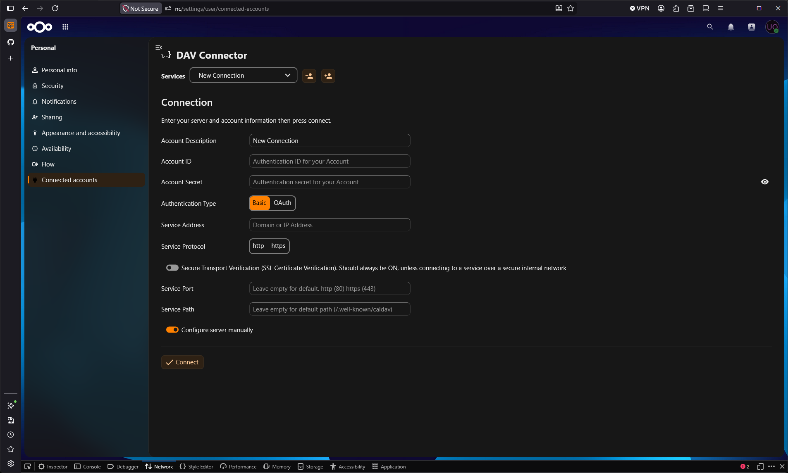
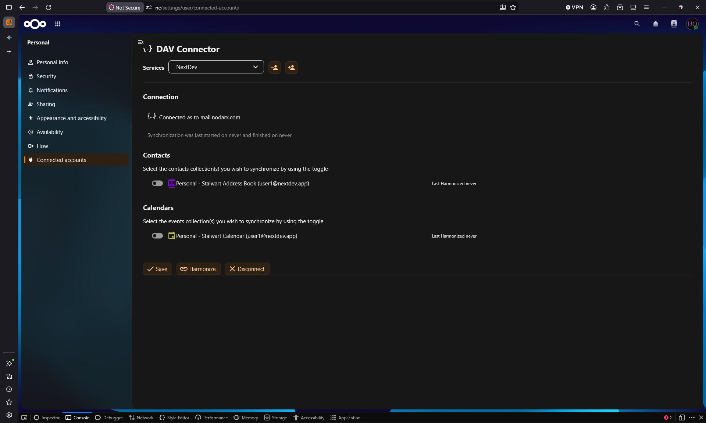

# Nextcloud DAV Connector

Nextcloud DAV Connector lets users connect external DAV services such as CalDAV and CardDAV to their Nextcloud account.

Once connected, remote calendars and address books are exposed inside Nextcloud as additional usable calendars and contacts sources, so they can be used alongside local Nextcloud data.

Connected resources can be accessed directly from Nextcloud for reading and writing, depending on the capabilities and permissions provided by the external DAV service.

## Configuration

Users can add a new connection from the connected accounts settings page and provide the DAV service details manually when needed.

